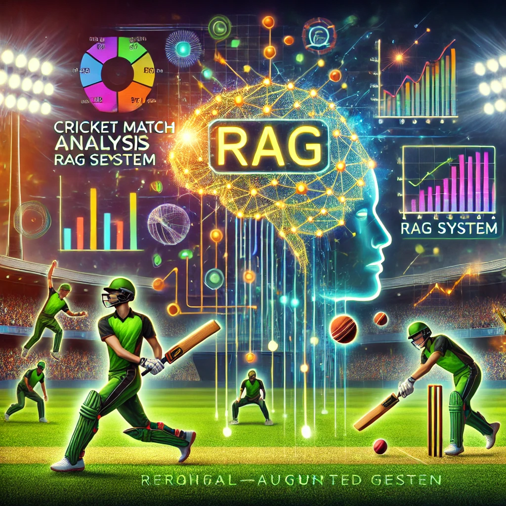

# Cricket Match Analysis RAG System

A Retrieval-Augmented Generation (RAG) system specifically designed for cricket match analysis, tactical decision-making, and player performance prediction, powered by Google's Gemini Pro.

[](https://stv-sport-rag.streamlit.app/)



## Features

- Query-based cricket match analysis using Google Gemini Pro
- Comprehensive match analysis including:
  - Partnership tracking and analysis
  - Batter vs bowler statistics
  - Fielding contributions and patterns
  - Phase-wise analysis (powerplay, middle overs, death overs)
  - Risk analysis and scoring patterns
- Interactive Streamlit web interface with:
  - Match selection for targeted analysis
  - Detailed match context display
  - Rich match metadata visualization
- Support for multiple data input methods:
  - JSON match files
  - Direct text input
  - File uploads
- Context-aware responses with source information

## Setup

### Option 1: Using Conda (Recommended)

1. Create and activate the conda environment:
```bash
# Create the environment from the environment.yml file
conda env create -f environment.yml

# Activate the environment
conda activate cricket-rag
```

### Option 2: Using pip

1. Install dependencies:
```bash
pip install -r requirements.txt
```

### Common Setup Steps

1. Set up environment variables:
```bash
# Add your Google API key to .env file
echo "GOOGLE_API_KEY=your_api_key_here" > .env
```

2. Prepare your data:
Place your cricket match JSON files in the `data` directory.

3. Start the Streamlit app:
```bash
streamlit run app.py
```

## Using the Web Interface

The Streamlit interface provides three main functionalities:

### 1. Query Matches
Use the "Query Matches" tab to ask detailed questions about:
- Match progression and key moments
- Player performance analysis
- Partnership analysis and game situations
- Tactical patterns and decision points
- Statistical comparisons and trends

The system provides comprehensive analysis using Google's Gemini Pro AI model and shows:
- Detailed match analysis
- Referenced matches with metadata
- Match context and statistics

### 2. Add Match Data
Use the "Add Match Data" tab to:
- Input match details directly
- Add metadata (teams, tournament, date)
- Process and index the data for future queries

### 3. Upload Match Files
Use the "Upload Match File" tab to:
- Upload JSON match files
- Process text-based match data
- Automatically index content for analysis

## Example Queries

1. **Match Analysis**
   - "Compare the powerplay performance of both teams, including run rate, boundaries, and wickets lost"
   - "Analyze the death overs performance of both teams"
   - "How did the match situation evolve in the middle overs?"

2. **Player Performance**
   - "Which batters had the best strike rate against spin bowlers?"
   - "Compare the economy rates of bowlers in different phases"
   - "Who were the most effective batsmen in rotating strike?"

3. **Partnership Analysis**
   - "What was the highest partnership and how did they pace their innings?"
   - "Analyze how partnerships handled different bowlers"
   - "Compare partnership strategies in different phases"

4. **Fielding Analysis**
   - "Who took the most catches in the match?"
   - "Analyze the fielding positions where most wickets fell"
   - "Compare the fielding performances of both teams"

## Data Format

The system accepts cricket match data in JSON format with the following structure:
- Match metadata (teams, venue, date)
- Ball-by-ball information
- Player details and statistics
- Partnership and dismissal details
- Fielding positions and contributions

## Technical Details

The system uses:
- Google Gemini Pro for natural language understanding and generation
- Google PaLM embeddings for semantic search
- ChromaDB for vector storage
- Streamlit for the web interface
- Conda/pip for dependency management

## Contributing

1. Fork the repository
2. Create your feature branch
3. Commit your changes
4. Push to the branch
5. Create a new Pull Request
